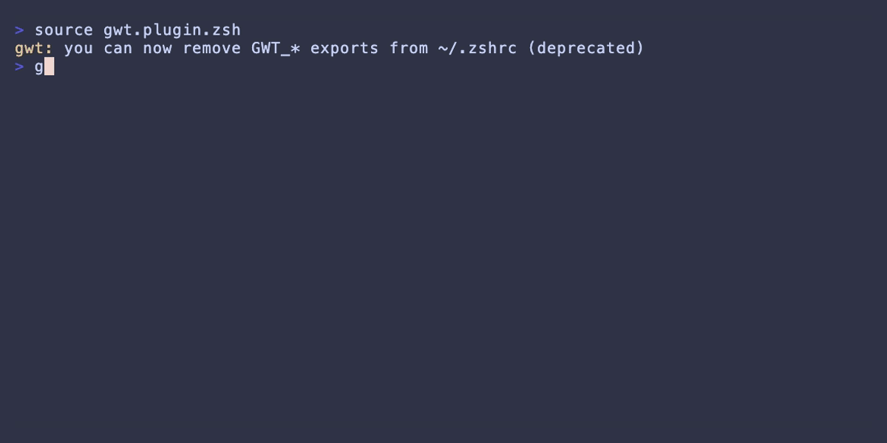

# gwt-zsh

**Stupidly simple git worktree management.**

Stop typing `git worktree add ../myrepo-feature ../myrepo-feature feature/branch` every time. Just type `gwt feature/branch` and get on with your life.



## Features

- **Smart Worktree Creation** - Auto-names worktrees from branch names and cd's into them
- **Worktree Stacking** - Create worktrees from current branch and navigate back to parent
- **Root Navigation** - Jump to the main worktree from anywhere in the chain
- **Interactive Pruning** - Clean up old worktrees with fzf multi-select (dependency-aware)
- **List Worktrees** - See all worktrees at a glance with hierarchy indicators
- **Copy Config Dirs** - Automatically copy `.vscode/`, `.env`, etc. to new worktrees
- **Tab Completion** - Full zsh autocompletion for all commands, flags, branches, and worktree names
- **fzf Integration** - Fuzzy-searchable menus (with fallback for non-fzf setups)

## Quick Start

```bash
# Create worktree from main branch (default)
gwt feature/add-user-auth          # Creates ../myrepo-add-user-auth

# Create stacked worktree from current branch
gwt --stack feature/child-branch   # Branches from current, tracks parent

# Navigate back to parent worktree
gwt --base                         # or: gwt ..

# Navigate to main worktree (ultimate root)
gwt --root                         # or: gwt ...

# List all worktrees with hierarchy
gwt --list

# Show stack info for current worktree
gwt --info

# Prune old worktrees interactively
gwt --prune

# Configure directories to copy to new worktrees
gwt --config

# Help
gwt --help
```

## How Naming Works

`gwt` creates worktrees in a sibling directory with automatic naming:

- **Linear branches** (`*/eng-XXXX-*`): Uses the ticket number
  ```
  gwt aasim/eng-1045-allow-changing-user-types
  # Creates: ../myrepo-eng-1045
  ```

- **Regular branches**: Uses first 3 words of the branch name
  ```
  gwt feature/add-new-dashboard-components
  # Creates: ../myrepo-add-new-dashboard
  ```

`gwt` always `cd`s into the worktree after creation. If the worktree already exists, it just `cd`s into it.

## Installation

### Oh-My-Zsh
```bash
git clone https://github.com/aasimsani/gwt-zsh ~/.oh-my-zsh/custom/plugins/gwt
omz plugin enable gwt
```

> **Note:** If you use the OMZ `git` plugin, it defines an alias `gwt='git worktree'` that conflicts with this plugin. gwt-zsh automatically removes this alias on load and prints a warning. No action needed on your part.

### Other Plugin Managers
```zsh
# Antigen
antigen bundle aasimsani/gwt-zsh

# Zplug
zplug "aasimsani/gwt-zsh"

# Zinit
zinit light aasimsani/gwt-zsh

# Zgenom
zgenom load aasimsani/gwt-zsh
```

### Optional: Install fzf for Better UI

`gwt` uses [fzf](https://github.com/junegunn/fzf) for interactive menus when available. Without fzf, it falls back to numbered menus.

```bash
# macOS
brew install fzf

# Ubuntu/Debian
sudo apt install fzf

# Arch
sudo pacman -S fzf
```

To disable fzf and use numbered menus instead:
```bash
export GWT_NO_FZF=1
```

### Configuration

gwt uses a layered config system. Settings are resolved in priority order:

1. **Environment variables** (highest priority)
2. **Local config** (`.gwt/config` in repo root — per-repo overrides)
3. **Global config** (`~/.config/gwt/config` — user defaults)
4. **Built-in defaults**

Run `gwt --config` to interactively configure all settings.

**Config file format** (same for global and local):
```
GWT_MAIN_BRANCH=develop
GWT_COPY_DIRS=.vscode,.env
GWT_ALIAS=wt
# GWT_NO_FZF=1
# GWT_POST_CREATE_CMD=npm install
```

**Environment variables** (override config files):
```bash
export GWT_MAIN_BRANCH="main"       # Default base branch (default: "main")
export GWT_COPY_DIRS=".vscode,.env" # Directories to copy to new worktrees
export GWT_ALIAS="wt"               # Alias for gwt command (default: "wt", "" to disable)
export GWT_NO_FZF=1                 # Disable fzf menus
export GWT_POST_CREATE_CMD="npm install"  # Command to run after worktree creation
```

> **Migration:** If you have `GWT_*` exports in `~/.zshrc`, gwt automatically migrates them to `~/.config/gwt/config` on first load. The old exports keep working but you'll see a deprecation notice until you remove them.

By default, gwt creates a `wt` alias so you can use `wt` instead of `gwt`:
```bash
wt feature/add-user-auth          # Same as: gwt feature/add-user-auth
wt --stack feature/child-branch   # Same as: gwt --stack feature/child-branch
```

To disable the alias or use a custom one:
```bash
export GWT_ALIAS=""       # No alias
export GWT_ALIAS="gw"    # Use 'gw' instead of 'wt'
```

## Uninstallation

### Oh-My-Zsh
```bash
omz plugin disable gwt
rm -rf ~/.oh-my-zsh/custom/plugins/gwt
```

### Other Plugin Managers
```zsh
# Antigen - remove the bundle line from ~/.zshrc, then:
antigen cleanup

# Zplug - remove the zplug line from ~/.zshrc, then:
zplug clean

# Zinit - remove the zinit line from ~/.zshrc, then:
zinit delete aasimsani/gwt-zsh

# Zgenom - remove the zgenom line from ~/.zshrc, then:
zgenom clean
```

### Optional: Clean up Configuration

If you configured copy directories, remove this line from `~/.zshrc`:
```bash
export GWT_COPY_DIRS="..."
```

### Note on Worktrees

Uninstalling gwt-zsh does **not** remove any git worktrees you created. Those are standard git worktrees and can be managed with:
```bash
git worktree list    # See all worktrees
git worktree remove <path>  # Remove a specific worktree
git worktree prune   # Clean up stale references
```

## Usage

### Creating Worktrees

Create worktrees with automatic naming and instant navigation:

```bash
# Create from main branch (default behavior)
gwt your-name/eng-1234-feature-description
gwt feature/add-new-dashboard

# Stack: create from current branch
gwt --stack feature/child-feature    # or: gwt -s feature/child-feature

# Explicit base: create from specific branch
gwt --from develop feature/new       # or: gwt -f develop feature/new
```

**Example workflow:**
```bash
# You're working on main in ~/code/myapp
cd ~/code/myapp

# Create a worktree for a new feature
gwt feature/user-auth
# Now you're in ~/code/myapp-user-auth on branch feature/user-auth

# The original repo is untouched
ls ~/code/myapp          # Still on main
ls ~/code/myapp-user-auth # Your new worktree
```

### Worktree Stacking

When you use `--stack` or `--from`, gwt tracks the parent-child relationship. This is useful for dependent feature branches:

```bash
# Start on main
gwt feature/parent           # Creates worktree from main

# Create child from parent
gwt --stack feature/child    # Branches from feature/parent

# Navigate back to parent
gwt --base                   # or: gwt ..

# See stack info
gwt --info                   # Shows base branch and dependents
```

**Example - Building dependent features:**
```bash
# Working on main
gwt feature/api-v2                    # Create API v2 feature

# Now in api-v2, create dependent UI work
gwt --stack feature/api-v2-dashboard  # Stacked on api-v2

# Navigate up the chain
gwt ..                                # Back to api-v2
gwt ...                               # Back to main (ultimate root)
```

### Navigation Commands

Navigate between worktrees in a chain:

| Command | Shorthand | Description |
|---------|-----------|-------------|
| `gwt --base` | `gwt ..` | Navigate to immediate parent worktree |
| `gwt --root` | `gwt ...` | Navigate to main worktree (ultimate root) |

**Example - Deep worktree chain:**
```bash
# Worktree chain: main -> feature/api -> feature/api-tests -> feature/api-tests-mocks
# Currently in: feature/api-tests-mocks

gwt ..    # Goes to feature/api-tests (immediate parent)
gwt ...   # Goes to main (ultimate root, skipping all intermediates)
```

**When to use each:**
- `gwt ..` - When you need to go back one level to the parent branch
- `gwt ...` - When you need to return to the original repo root, regardless of depth

### Listing Worktrees

```bash
gwt --list
```

Shows all worktrees with status and hierarchy:
- `●` exists
- `○` missing (stale reference)
- `└─` indicates a stacked worktree

**Example output:**
```
Worktrees for myapp:

● main                    ~/code/myapp
  └─ ● feature/api        ~/code/myapp-api
      └─ ● feature/api-v2 ~/code/myapp-api-v2
● feature/unrelated       ~/code/myapp-unrelated
```

### Worktree Info

```bash
gwt --info       # or: gwt -i
```

Shows current worktree's stack relationships:
- Current branch and path
- Main worktree (ultimate root)
- Base worktree (if stacked)
- Dependent worktrees (children)

**Example output (from a stacked worktree):**
```
Worktree Info

  ● Branch: feature/api-v2
    Path: /Users/you/code/myapp-api-v2

Main Worktree (use gwt ... or gwt --root to navigate)

  ● Path: /Users/you/code/myapp

Base Worktree (use gwt .. or gwt --base to navigate)

  ● Branch: feature/api
    Path: /Users/you/code/myapp-api

Dependents (worktrees based on this branch)

  ├─ myapp-api-v2-tests
  ├─ myapp-api-v2-docs
```

### Pruning Worktrees

```bash
gwt --prune
```

Interactive multi-select to remove old worktrees. Shows uncommitted changes warnings and dependency counts before deletion.

**Features:**
- Multi-select with fzf (or numbered menu fallback)
- Shows uncommitted changes warning for each worktree
- Displays dependency count (how many worktrees depend on this one)
- Double confirmation for safety (yes/no + type "DELETE")
- Cascade option to delete dependents automatically

**Example workflow:**
```bash
gwt --prune
# Select worktrees with space, confirm with enter
# Review warnings about uncommitted changes
# Confirm deletion
```

### Copy Config Directories

When creating worktrees, config files (`.vscode/`, `.serena/`, etc.) aren't automatically available. Use this to copy them:

```bash
# Interactive config menu
gwt --config

# Or set in config file (~/.config/gwt/config)
# GWT_COPY_DIRS=serena,.vscode,scripts

# Copy specific dirs when creating worktree
gwt --copy-config-dirs .vscode feature/my-branch

# List configured directories
gwt --list-copy-dirs
```

**Example - Setting up IDE config for all worktrees:**
```bash
# Configure once
gwt --config
# Add: .vscode
# Add: .idea
# Done

# Now every new worktree gets your IDE settings
gwt feature/new-feature
# .vscode/ and .idea/ are automatically copied
```

### Post-Create Hooks

Run a command automatically after every worktree creation:

```bash
# Via config (gwt --config → Post-create command)
# GWT_POST_CREATE_CMD=npm install

# Or via a script in the repo
mkdir -p .gwt
echo '#!/bin/sh
npm install' > .gwt/post-create.sh
chmod +x .gwt/post-create.sh
```

The `.gwt/post-create.sh` script takes precedence over `GWT_POST_CREATE_CMD`. If the hook fails, worktree creation still succeeds (a warning is printed).

### Tab Completion

gwt includes full zsh tab completion out of the box. Just press `<TAB>` and it works:

```bash
gwt --<TAB>          # All flags with descriptions
gwt --from <TAB>     # Local + remote branch names
gwt <TAB>            # Branch names, worktree names, and navigation shortcuts (.., ...)
```

Completions are registered automatically for both `gwt` and its alias (default: `wt`). No extra setup required — if your shell has `compinit` loaded (standard for oh-my-zsh and most zsh setups), completions are available immediately after installation.

**What gets completed:**
- All flags (`--stack`, `--from`, `--list`, `--prune`, etc.) with descriptions
- Branch names (local and remote, deduplicated) for `--from` and positional arguments
- Existing worktree branch names for quick navigation
- Navigation shorthands (`..` for parent, `...` for root)
- Directory paths for `--copy-config-dirs`

### AI Assistant Integration

Set up gwt as a skill in [Claude Code](https://claude.com/claude-code) so it knows all gwt commands:

```bash
gwt --setup-skill    # Installs to ~/.claude/skills/gwt/SKILL.md
```

Then type `/gwt` in any Claude Code session to load the full command reference. Claude will also auto-invoke the skill when you ask about git worktrees.

The `--setup-ai` flag is an alias for `--setup-skill`.

### Other Commands

```bash
gwt --version    # Show version
gwt --update     # Update to latest
gwt --help       # Show help
```

## Command Reference

| Command | Shorthand | Description |
|---------|-----------|-------------|
| `gwt <branch>` | | Create worktree from main branch |
| `gwt --stack <branch>` | `gwt -s <branch>` | Create worktree from current branch |
| `gwt --from <base> <branch>` | `gwt -f <base> <branch>` | Create worktree from specified branch |
| `gwt --base` | `gwt ..` | Navigate to parent worktree |
| `gwt --root` | `gwt ...` | Navigate to main worktree |
| `gwt --info` | `gwt -i` | Show stack info |
| `gwt --list` | | List all worktrees |
| `gwt --prune` | | Interactive worktree cleanup |
| `gwt --config` | | Configure all gwt settings |
| `gwt --copy-config-dirs <dir>` | | Copy directory when creating worktree |
| `gwt --list-copy-dirs` | | List configured directories |
| `gwt --setup-skill` | `gwt --setup-ai` | Install Claude Code skill globally |
| `gwt --version` | | Show version |
| `gwt --update` | | Update to latest |
| `gwt --help` | `gwt -h` | Show help |

## Security

- **No network operations** - never pushes or contacts remotes
- **No code execution** - never runs scripts from repositories
- **Input validation** - rejects path traversal, absolute paths, shell metacharacters

## Development

```bash
# Install dependencies
brew install zunit-zsh/zunit/zunit

# Run tests
zunit

# Coverage check
zsh scripts/coverage_check.zsh

# Enable pre-commit hook
git config core.hooksPath .githooks
```

## License

MIT
